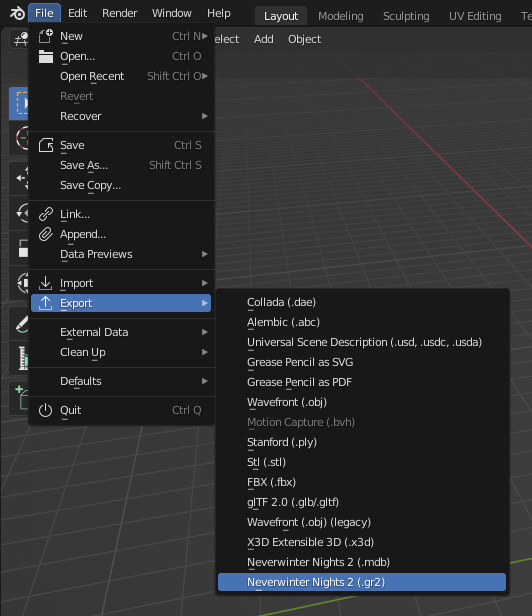

# Tutorial: Animating a complex placeable

This tutorial uses Blender 3.3.1.

# What is a complex animated placeable?

In NWN2, an animated placeable can consist of several parts, where each part
has its own animation curve. One part must be the **base part**, and the other
parts are the **attached parts**. Each part is stored in its own MDB file. The
name of the attached parts must be same as the base part followed by an
underscore and a two-digit number that starts with **01** for the first
attached part. For example, the placeable **Chest (01 Medium)** is composed of
the following parts:

- **Base part**: **PLC_ML_CHESTM01.MDB**
- **Attached part**: **PLC_ML_CHESTM01_01.MDB**

(You can find these files in **Data\NWN2_Models.zip**, located at the NWN2
installation directory).

# Creating an animated complex placeable

First, you should read the tutorial about [animating a simple
placeable](animated_placeable), which explains the fundamentals. This section
isn't going to be as detailed as that tutorial because I'm going to assume you
know them.

## Step 1: Create the models and animations

1. Create the models and animations. You must create the base part, the
   attached parts and other objects as needed (collision mesh, walk mesh and so
   on).
2. The name of the attached parts must be same as the base part followed by an
   underscore and a two digit number that starts with **01** for the first
   attached part.
3. The attached parts must be children of the base part or another attached
   part.
4. In object mode, select the base part, go to the panel **NWN2** in the object
   properties and check **Base Part**.

   

## Step 2: Export a MDB file for each part

1. Export to MDB only the base part.
2. Do the same for each attached part.

## Step 3: Export the GR2 skeleton

1. Go to **File** > **Export** > **Neverwinter Nights 2 (.gr2)**

   

2. Select **Skeletons** in the **Export** field.

   

3. Navigate to the directory where you want to export, type the file name, and
   click **Export GR2**.

## Step 4: Export the GR2 animation

1. Go to **File** > **Export** > **Neverwinter Nights 2 (.gr2)**

   

2. Select **Animation** in the **Export** field.

   

3. Navigate to the directory where you want to export, type the file name, and
   click **Export GR2**.

## Step 5: Edit placeables.2da

We have generated all the files we need: a MDB for each part, a GR2 containing
the skeleton and a GR2 file containing the animation. Now, you must add or edit
the row of the placeable in **placeables.2da** as follows:

1. Column **PlaceableModelType**: set to 2 to indicate it's an animated
   placeable.
2. Column **NWN2_Skeleton**: the name of the GR2 file containing the skeleton
   without the file extension. For example: **PLC_ML_CHESTM01**.
3. Column **AttachedModelName**: if the placeable has only one attached part,
   you can just set the name of the attached part. If the placeable has more
   than one attached part, you must set the name of the base part follow by an
   underscore and two question marks. For example: **PLC_ML_CHESTM01_??**. This
   also works for one attached part.
4. Column **SoundAppType**: this is a reference to **placeableobjsnds.2da**,
   which defines a "placeable sound set" consisting of entries for sound to
   play on opened, closed, etc. The default row, row 0, is the row for a medium
   wood chest, so that is the sound set that will play if this entry is left as
   `****`.
