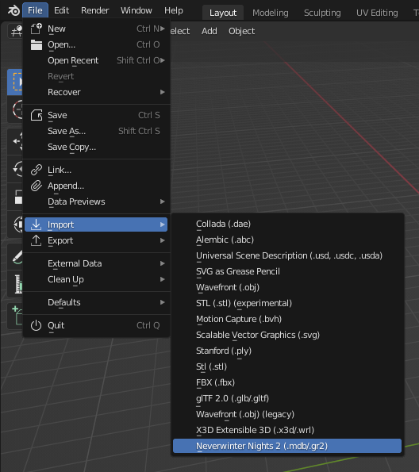
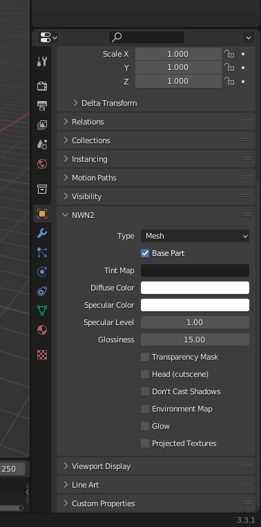
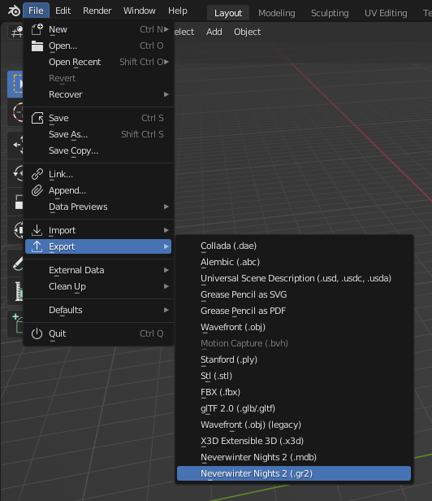
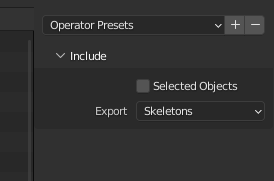
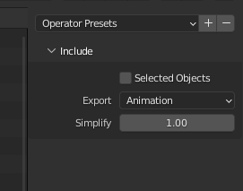

# Blender Add-on for *Neverwinter Nights 2*

# Tutorial: Animating a simple placeable

In this tutorial we are going to take the banner of Tyr, which is a placeable
included in NWN2, and make it animated. But first we are going to explain some
basics.

This tutorial uses Blender 3.3.1.

# Placeable Animations

A placeable can have many animations. Each animation is stored in a file named
same as the placeable followed by an underscore, the name of the animation and
the extension GR2. There is a set of standard placeable animations that are
used by NWN2:

- placeable_name_**IDLE**.GR2: Default animation. Used also for the closed
  state.
- placeable_name_**PLC_OPENIDLE**.GR2: Animation for the open state.
- placeable_name_**PLC_OPEN**.GR2: Opening animation (from closed to open).
- placeable_name_**PLC_CLOSE**.GR2: Closing animation (from open to closed).
- placeable_name_**PLC_TURNON**.GR2: Activating animation.
- placeable_name_**DR_OPEN1**.GR2: Opening door animation (direction 1, e.g.
  push).
- placeable_name_**DR_OPEN2**.GR2: Opening door animation (direction 2, e.g.
  pull).

Only the **IDLE** animation is required.

# Animation Blending

For the placeable **Chest (01 Medium)**, we find in `Data\lod-merge.zip` two
animations:

- **PLC_ML_CHESTM01_IDLE.GR2**: Idle animation for the closed state.
- **PLC_ML_CHESTM01_PLC_OPENIDLE.GR2**: Idle animation for the open state.

However, if you click the chest in game to open or close it, you will see
opening and closing animations. Why is that? That is because the transition
from one animation to another animation is not instant. Instead, the NWN2
engine transitions gradually, blending the two animations. This way, if you
want to animate a placeable, you can save from making some animations as long
as the blending produces the result you want.

**Note:** For the animation blending to work, the **IDLE** animation must have
only one frame.

# Step 1: Import the MDB

1. Extract **PLC_MC_TyrBanner.MDB** from **Data\NWN2_Models.zip** located at
   the NWN2 install directory.
2. Open Blender.
3. Go to **File** > **Import** > **Neverwinter Nights 2 (.mdb/.gr2)**

   

4. Navigate to the directory where **PLC_MC_TyrBanner.MDB** is located, select
   it and click **Import MDB/GR2** or double click the file.

   **Note**: The import function should automatically extract the textures used
   by the models (**PLC_MC_TyrBanner.dds** and **PLC_MC_TyrBanner_N.dds**).

# Step 2: Animate the model

Now animate the model as you wish.

# Step 3: Export the GR2 skeleton

1. In object mode, select the banner, go to the panel **NWN2** in the object
   properties and check **Base Part**.

   

2. Go to **File** > **Export** > **Neverwinter Nights 2 (.gr2)**

   

3. Select **Skeletons** in the **Export** field.

   

4. Navigate to the directory where you want to export, type the file name
   **PLC_MC_TyrBanner.gr2** and click **Export GR2**.

# Step 4: Export the GR2 animation

1. Go to **File** > **Export** > **Neverwinter Nights 2 (.gr2)**

   

2. Select **Animation** in the **Export** field.

   

3. Navigate to the directory where you want to export, type the file name
   **PLC_MC_TyrBanner_idle.gr2** and click **Export GR2**.

# Step 5: Edit placeables.2da

We have generated all the files we need, **PLC_MC_TyrBanner.gr2** and
**PLC_MC_TyrBanner_idle.gr2**, but now we must link the placeable to the
skeleton. To do that, you must edit the file **placeables.2da** and modify the
line of the placeable as follows:

1. Column **PlaceableModelType**: set to 2.
2. Column **NWN2_Skeleton**: set to **PLC_MC_TyrBanner**.

Video showing final result:
[https://youtu.be/tB5HyjDmG0A](https://youtu.be/tB5HyjDmG0A)
