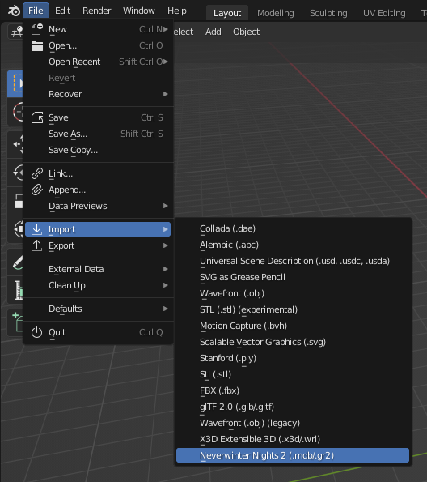
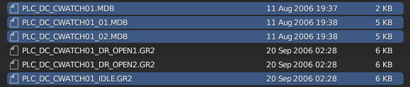
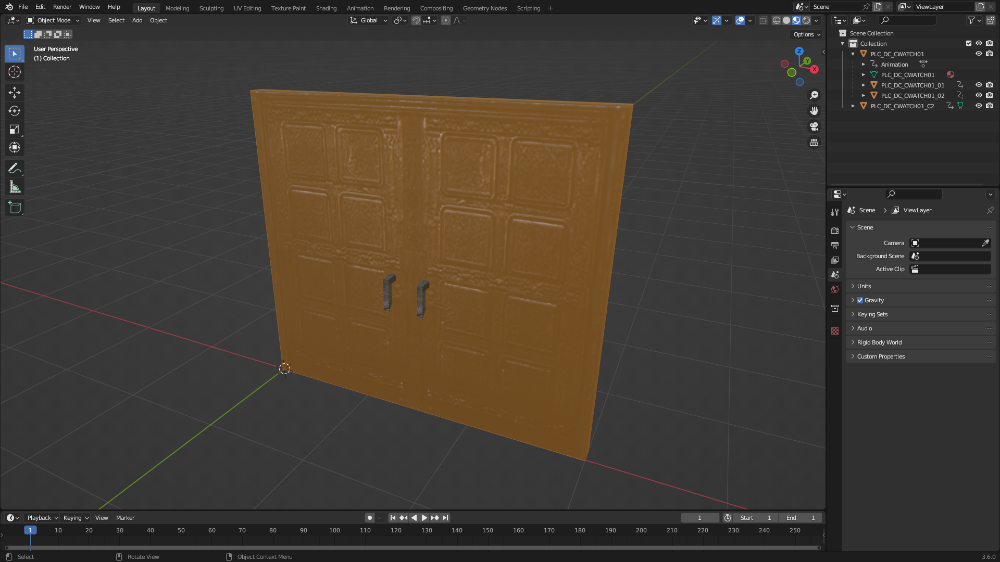

# Importing a complex door into Blender

A complex door is a door with more than one part, like for example a double
door.

For this tutorial, we are going to use as an example the double door at row 336
in **doortypes.2da**. We need to extract these MDBs from
**Data/NWN2_Models.zip**:

- Base part: **PLC_DC_CWATCH01.MDB**
- Attached part: **PLC_DC_CWATCH01_01.MDB**
- Attached part: **PLC_DC_CWATCH01_02.MDB**

Note that we said that it was a double door, however, there are three MDBs.
This is because one MDB must be used as a dummy base part (in our example
**PLC_DC_CWATCH01.MDB**) and the other MDBs as attached parts (in our example
**PLC_DC_CWATCH01_01.MDB** and **PLC_DC_CWATCH01_02.MDB**, which are the real
door parts).

We also need to extract at least one of the following animations from
**Data/lod-merged.zip**:

- **PLC_DC_CWATCH01_DR_OPEN1.GR2**
- **PLC_DC_CWATCH01_DR_OPEN2.GR2**
- **PLC_DC_CWATCH01_IDLE.GR2**

Note that NWN2 also uses a skeleton for doors, but the Blender add-on allows us
to work with animations applied directly to door parts without the need for a
skeleton, which we think makes things easier.

# Steps to import the complex door

1. Go to **File** > **Import** > **Neverwinter Nights 2 (.mdb/.gr2)**

   

2. Select the three MDB files and one of the animations from the file browser
   and click **Import MDB/GR2**.

   

   **Note**: To select several files you need to hold `CTRL` while clicking.

   **Note**: The import function will search in the game data files for the
   model textures and extract them for you.

# Observations

This is a screenshot of the door imported with the idle animation.

Note how the attached parts **PLC_DC_CWATCH01_01** and **PLC_DC_CWATCH01_02**
are children of the base part **PLC_DC_CWATCH01**.

In object mode, select the base part **PLC_DC_CWATCH01**, go to the panel
**NWN2** in the object properties, and observe that the **Base Part** is
checked.
