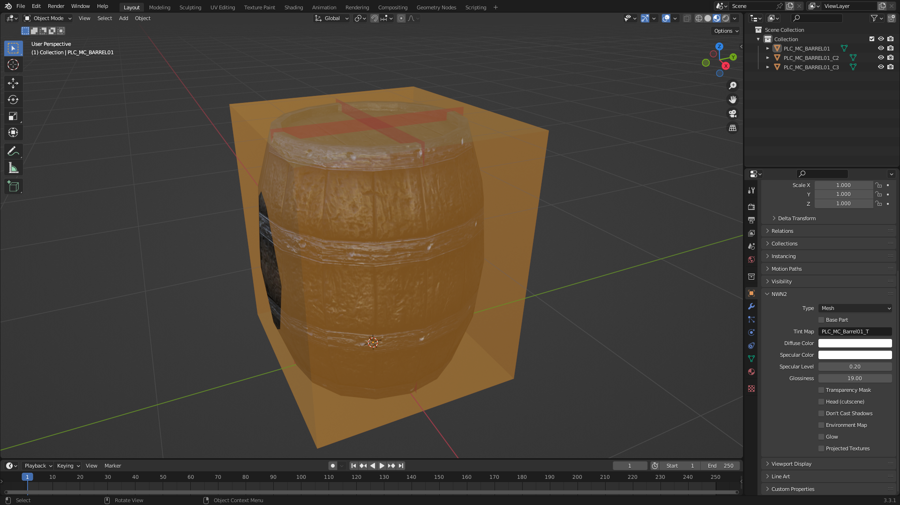

# Blender Add-on for *Neverwinter Nights 2*

# Tutorial: Import simple placeable

This tutorial uses Blender 3.3.1.

## Steps

1. Go to **File** > **Import** > **Neverwinter Nights 2 (.mdb/.gr2)**

   

2. Select the desired MDB file from the file browser and click **Import
   MDB/GR2** or double click the file.

   **Tip**: You can select more than one file by holding `CTRL` while clicking.

   **Note**: The import function will search in the game data files for the
   model textures and extract them for you.

## Example

We are going to use `PLC_MC_BARREL01.MDB` as an example. This is how it should
look when imported into Blender:

In the outliner we can see three objects:

- `PLC_MC_BARREL01` is the placeable model.
- `PLC_MC_BARREL01_C2` is the collision mesh type 2. It's a coarse collision
  mesh.
- `PLC_MC_BARREL01_C3` is the collision mesh type 3. It's a detailed collision
  mesh.

Select the object `PLC_MC_BARREL01`. In the **Object Properties** there is the
panel **NWN2** with object properties specific to Neverwinter Nights 2.

In the **Shader Editor**, we can see the diffuse texture and the normal map
used by the placeable:

