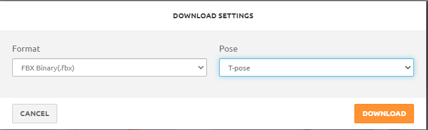
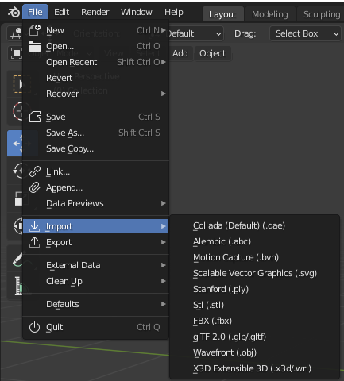
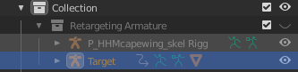

# Part 1: NWN2 Blender Introduction tutorial - Animations 

*By Kism of Jude Inc.*

Hello! We will be going over the basic tutorial to get you started on your
development adventure, no need for prior experience with Blender, or NWN2
modding. Take your time, once you get the hang of it, it only takes 15 seconds
per animation. (feel free to edit blend file) You will need:

- A way to open Zip files
- Blender 2.91: [https://download.blender.org/release/](https://download.blender.org/release/)
- A Mixamo Account: [https://www.mixamo.com/#/](https://www.mixamo.com/#/)
- [Nwn2 animation list](https://nwn2.fandom.com/wiki/PlayCustomAnimation:_List_of_animations)
- Nwn2MDK 0.14:  https://github.com/Arbos/nwn2mdk/releases/tag/0.14
Shout-out to <FreshLook> and <Skywing>
- Animation Tutorial: [https://www.dropbox.com/s/qx644w5r2k17phk/Animation%20Tutorial-Blender.rar?dl=0](https://www.dropbox.com/s/qx644w5r2k17phk/Animation%20Tutorial-Blender.rar?dl=0)
Original design given to me by *Wobbin* Thanks for the kick start bro.

## Introduction!

  
The Blend file comes with a pregenerated set up so with everything you will
need.  If this is your first time with blender below is a bit of information
you can use to start you off.  If not, go ahead and skip to **Getting started
in mixamo!** 

ViewPort (Sub-section) Object-Mode:

  
Familiarize yourself with the middle mouse button scrolling, it is very similar
to Nwn2 gameplay so it should be relatively easy to get used to, and is the
primary area you will be using while using this tutorial.

Property Outliner:                                             

This is the section where all the objects/models/and mechanics for the set up
are stored, so if you are looking for something specific you can find them
here. To see the contents inside both the **Include/Exclude Box**, and the
**Viewport Display** eye-icon needs to be checked.. This is to reduce lag on
larger projects. Go ahead and check the **Human/Male** **Include/Exclude Box**.

ViewPort(Sub-section)Pose-Mode:

Pose mode is the animation tab, where you will be applying animation to the
skeletons.
                                                                    
DopeSheet (Sub-section) Action Editor                   expand to show ACTION MENU

  
The Dope Sheet will show you if the Selected Object(s) Animation Data and the
Keyframes

Time Line:

Play options, and the START and END frames options can be adjusted here.

## Getting Started With Mixamo!  

After making a Mixamo account you will want to select the Upload Character
Option and import the FBX file that came with the Animation Tutorial. Make sure
you select the animation tab at the top left

  
*This tutorial version has its cape limits spinning too quickly or upside down
animations could cause the cloak clip through the character.*

Scroll, or Search through the animations and hit download 

  
Back to the “Outliner” Tab in blender we are going to check the Include/Exlude
Box so the Retargeting armature is visible. No need to click the enable in
viewport option as we can already see the Neverwinter character. You only need
to be able to select the “Target'' Armature.
  

Import the FBX file animation you chose on the Mixamo website:

After importing the FBX, you will see two new Objects enter the viewport and
are preselected.  You can delete these, once the animation is imported into
blender it will automatically save in the ACTION MENU, down in the Timeline.

Select the Target Armature in the Outliner Tab

Left click Target Armature

Move to the Timeline Action Menu, and select the animation you imported while
having the target armature selected.
  

Note the START and END Frames of the animation in the Timeline(adjust end frames to match)

  
 Object Mode                      Orange highlight means primary/Red means secondary
  

Left click (p_hhmcapewing_skel) Shift+Left click (p_hhm_skel). Control+Tab which will change your Viewport from “Object” to “Pose” mode

  
 Pose Mode
  

press A to select all bones.Select the Pose Tab and navigate to “Bake Action”.

Select the Pose Tab and navigate to “Bake Action”.
  

Bake Action (using pregnerated animation for example)
  

Press OK after you have checked Visual Keying

Congrats! You are halfway there!
Nicely Done! (pardon me, my main computer died, will update this later)
  

Time to Export!
  

This set up runs in FBX format, so we will export this file to the NWN2MDK folder.

Export Settings
  

Be sure your export settings look like the image above.
Selected Objects: Checked

Armature:
Uncheck: Add Leaf Bones

Bake Animations: Checked
Key All Bones: Checked
Uncheck: NLA Strips
Uncheck: All Actions
Uncheck: Force Start/End Keying

Naming!  (using the website provided) (I selected the basic unarmed idle for the tutorial) 
  

Export FBX!

<NWN2MDK FOLDER!>
 

Inside the folder you will find the P_hhm_una_idle.FBX you exported from blender., Drag and Drop the file on top of the Application fbx2nw This will generate a new file named p_hhm_una_idle.GR2(Format Nwn2 uses)

<NWN2MDK FOLDER!>
 

 Move the new file to your neverwinter nights 2 Override Folder in your Documents folder.

Open the Character creation screen in NWN2!
