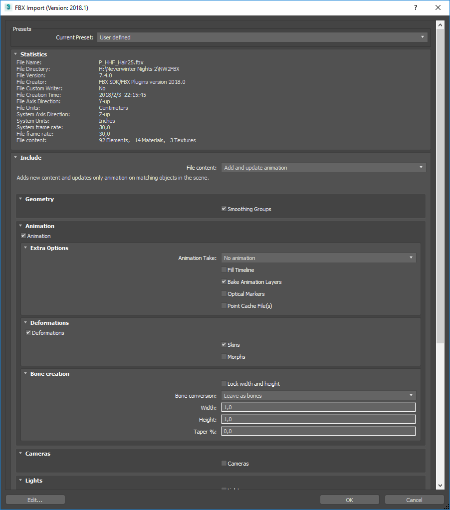

# Tutorial: Convert MDB/GR2 to FBX

# Converting MDB/GR2 to FBX

Open Windows Explorer and select one or more MDB files and/or one or more GR2
files. Drag the selected files and drop on **nw2fbx.exe** (this file is located
at the MDK directory). The outputs are:

* log.txt
* One FBX containing the conversion of all the input files. The name of the FBX
  is the name of file that was clicked when starting the drag operation but
  with '.fbx' extension.
* Texture files used by the passed MDB files only if they are found in
  `NWN2_directory/Data/NWN2_Materials*.zip` (they are automatically extracted)
  and if they don't already exist in the output directory (they are never
  overwrited).

# Importing a FBX into 3ds Max 2018

This is an example of import options that seem to work:

