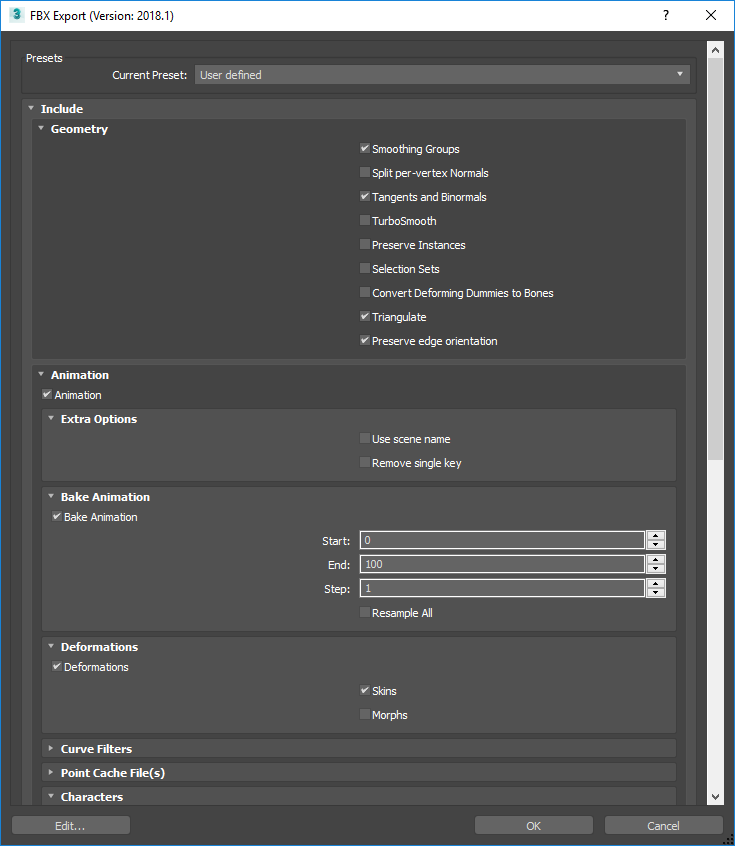
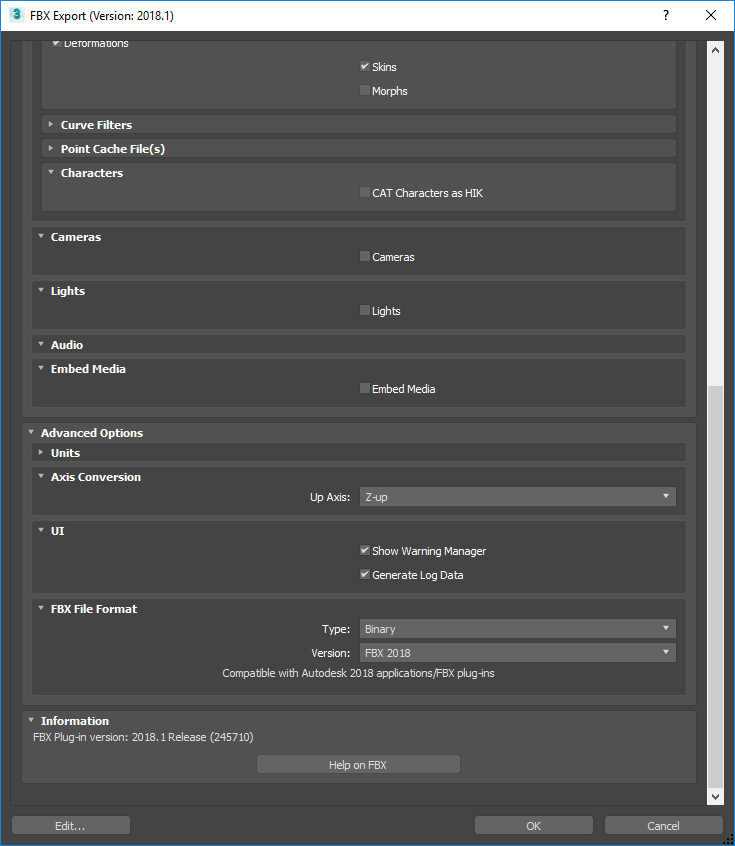

# Tutorial: Convert FBX to MDB/GR2

# Converting FBX to MDB/GR2

Open Windows Explorer, drag a FBX file and drop on **fbx2nw.exe** (this file is
located at the MDK directory). The outputs are:

* log.txt
* One MDB if the FBX contains model parts. The name of the MDB is the name of
  the FBX but with extension '.MDB'.
* One GR2 containing the skeletons if the FBX has skeletons. The name of the
  GR2 is the name of the FBX but with extension '.skel.gr2'.
* One GR2 animation if the FBX has an animation. The name of the GR2 is the
  name of the FBX but with extension '.anim.gr2'.

# Exporting a FBX from Blender

In order for a FBX to be correctly processed by **fbx2nw**, you need the following:

* Check **Custom Properties** in the **Main** tab.
* If there are meshes, make sure that **Tangent Space** is checked in the **Geometries** tab.
* If there are skeletons, uncheck **Add Leaf Bones** in the **Armatures** tab.
* If there are animations, make sure that **Baked Animation** is the only checked option in the **Animation** tab.

# Exporting a FBX from 3ds Max 2018

This is an example of export options that seem to work:

# Constraints

The NWN2 engine imposes some constraints to the art content. Following there is a not exhaustive list of this constraints.

## Meshes

- Object names can have no more than 32 characters.
- Object names must be unique.
- All faces must be triangles.

## Skeletons

- Skeleton names can have no more than 32 characters.
- Skeleton names must be unique.
- The skeleton name must be equal to the root bone name.
- Skeletons can have no more that one root bone.
- Skeletons can have no more that 54 bones. Facial bones (those that start with "f_") and attachment points (those that 
  start with "ap_") don't count.
