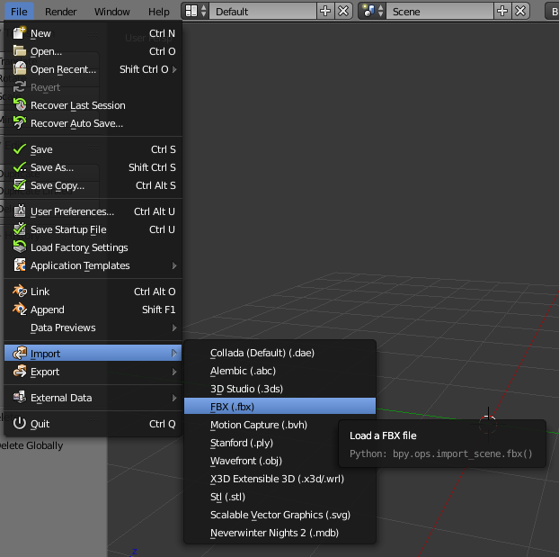
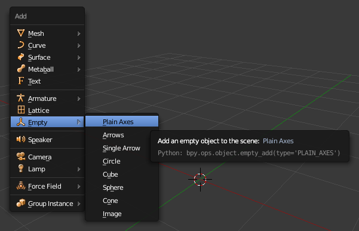
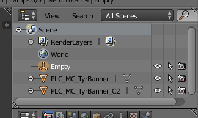
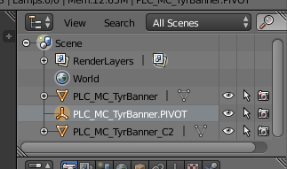
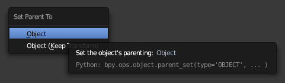
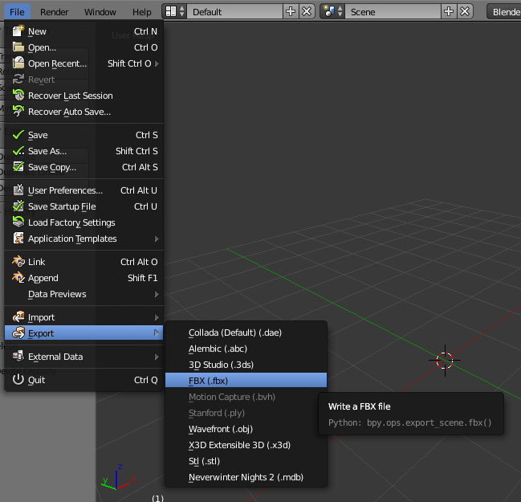
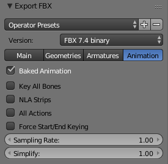

# Tutorial: Animated placeable

In this tutorial we are going to take the banner of Tyr, which is a placeable
included in NWN2, and make it animated using MDK and Blender.

**Note**: Similar instructions should be applicable to another computer
graphics program like 3ds Max or Maya. The key about MDK is that it works with
FBX, so it interoperates with any application that supports FBX.

# Step 1: Convert the MDB to FBX

1. Extract **PLC_MC_TyrBanner.MDB** from **Data\NWN2_Models.zip** located in
   the NWN2 install directory.
2. Drag and drop the MDB onto **nw2fbx-dragdrop.cmd**. This should give
   **PLC_MC_TyrBanner.fbx** and automatically extract the textures used by the
   models (**PLC_MC_TyrBanner.dds** and **PLC_MC_TyrBanner_N.dds**).

# Step 2: Import the FBX into Blender

1. Open Blender.
2. Go to **File** > **Import** > **FBX (.fbx)**

   

3. For importing NWN2 models, the default import options should be fine.
4. Navigate to the directory where **PLC_MC_TyrBanner.fbx** is located and
   double-click it.

# Step 3: Make animation pivot

MDK expects animations to be in local space (relative to a parent object) to
avoid problems with global transforms that may occur when importing/exporting
FBX. In order to do that, we must animated the model relative to a parent
object which the MDK calls the **animation pivot**.

1. Move the mouse cursor to the 3D view.
2. Press **SHIFT+A** and go to **Empty** > **Plain Axes**.

   

3. Look at the **Outliner** area to see the current scene objects:

   

   We must name the empty object as the model we want to animate and append
   ".PIVOT" to the end.

   

4. Select the model by right-clicking it, now right-click the pivot while you
   press the **SHIFT** key so you add it to the selection, press **CTRL+P** and
   select **Object**.

   

# Step 4: Animate the model

Now animate the model (not the pivot!) as you wish.

# Step 5: Export to FBX

1. Go to **File** > **Export** > **FBX (.fbx)**

   

2. In the Animation tab, check **Baked Animation** and uncheck the other options.

   

3. Navigate to the directory where you want to export, double-click the file
   you want to overwrite or type a file name and click **Export FBX**. In this
   tutorial, we use the file **tutorial.fbx**.

# Step 6: Convert FBX to NWN2

1. Drag and drop **tutorial.fbx** onto **fbx2nw-dragdrop.cmd**. This should
   generate **tutorial.MDB**, **tutorial.skel.gr2** and **tutorial.anim.gr2**. 
2. Ignore the generated MDB: in order to animate an existing MDB, we don't need
   to modify it at all.
3. Rename **tutorial.skel.gr2** to **PLC_MC_TyrBanner.gr2**.
4. Rename **tutorial.anim.gr2** to **PLC_MC_TyrBanner_idle.gr2**.

# Step 7: Edit placeables.2da

We have generated all the files we need, **PLC_MC_TyrBanner.gr2** and
**PLC_MC_TyrBanner_idle.gr2**, but now we must link the placeable to the
skeleton. To do that, you must edit the file **placeables.2da** and modify the
line of the placeable as follows:

1. Column **PlaceableModelType**: set to 2.
2. Column **NWN2_Skeleton**: set to **PLC_MC_TyrBanner**.

# Final words

Video showing final result:
[https://youtu.be/tB5HyjDmG0A](https://youtu.be/tB5HyjDmG0A)

This tutorial explains the simplest case for animating a placeable. Future
tutorials may explain:
- Animated multipart placeables.
- Animated placeable with several states: idle, open, ...
